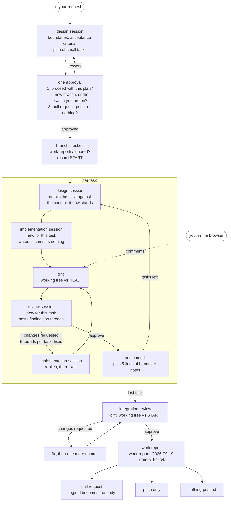
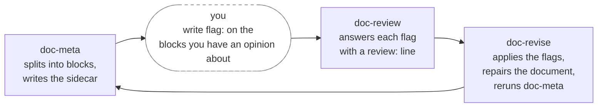

# annetaan

Claude Code skills from Annetaan Inc., packaged as one plugin.

```
/plugin marketplace add annetaan/claude-plugins
/plugin install annetaan@annetaan
```

Install it once. As skills get added, `/plugin marketplace update annetaan` and
`/plugin update annetaan@annetaan` are enough to keep up.

## Skills

A skill whose `description` matches a request normally starts without being named. The ones here do not. `workflow`
runs a long-lived local server, opens a browser and adds commits on its own. The doc skills make a file next to
your document, rewrite the document itself, and can add one commit of their own to `.gitignore` after asking.
Either is enough reason to wait, so each skill here starts only when you name it or invoke its slash form.

### workflow

`/annetaan:workflow` ([details](skills/workflow))

Runs one implementation through sessions with different jobs. A design session writes the plan, then details each
task as its turn comes. An implementation session writes the code for one task. A review session reads it and posts
findings. Those last two are new for every task. You approve once, near the start, and answer two questions about
where the commits go and how the run should end.

The review rounds happen in [difit](https://github.com/yoshiko-pg/difit), a local diff viewer. difit is the wire
between the implementation session and the review session, and it is also a web page. Open it and your comments
land in the same threads, on the same footing as the reviewer's.



The yellow block repeats for every task in the plan, and nothing inside it runs in parallel, because there is one
working tree. Everything after the approval runs on its own. A task that passes review becomes one commit, so the
commit list reads back as the plan. A task that does not settle in five rounds comes back to you with the open
points laid out, and its changes stay uncommitted in the working tree.

Every run leaves a work report behind, inside the repository under `work-reports/` so that you notice them piling
up. The skill checks that git ignores that directory before it writes anything, and asks before touching
`.gitignore`.

### doc-meta

`/annetaan:doc-meta <path>` ([details](skills/doc-meta/SKILL.md))

Splits a document into blocks and writes them into a sidecar file next to it, so you can write an opinion onto the
sentences that matter instead of asking a model to guess. A sub-agent reads the document and the sidecar whole, for
the repetition and the broken promises a single flagged sentence cannot catch. Run it again any time: it matches
old text against new, so a flag and a review survive as long as the words they sit on stay put.

The sidecar is written for you, in the language you are talking to Claude in. A document in another language gets a
translation under each sentence, so you can flag an English document while reading it in Japanese or German. The
document itself, and every edit `doc-revise` makes to it, stays in its own language.

`doc-review` and `doc-revise` complete the loop `doc-meta` starts.



### doc-review

`/annetaan:doc-review <path>` ([details](skills/doc-review/SKILL.md))

Reads the flags you wrote onto a `doc-meta` sidecar and answers each one with a `review:` line: what a `[delete]`
would cost, the other half of a duplication for a `[keep]`, a proposed sentence for an `[edit]`, an answer to a
`[question]`. It never touches the document, and it never touches a flag.

### doc-revise

`/annetaan:doc-revise <path>` ([details](skills/doc-revise/SKILL.md))

Applies the flags you wrote, with `doc-review`'s answers as advice: deletes what you flagged, edits what you asked
to edit, and holds `[keep]` and `[question]` blocks to their exact words while it rewrites the paragraphs around
them. It then checks the whole document for what the edit could have broken elsewhere, and reruns `doc-meta` so the
sidecar matches again.

## Agents

These are the sub-agents the skills spawn. Anything under `agents/` becomes callable as `annetaan:<name>`.
The model and the effort are pinned here, and a skill selects one by name alone.

| Agent | Model | Effort | Role |
| --- | --- | --- | --- |
| `annetaan:workflow-design` | opus | high | design. returns the design and the plan |
| `annetaan:workflow-worker` | opus | medium | implementation, for every task |
| `annetaan:workflow-reviewer` | opus | medium | review, for every task and the integration review |
| `annetaan:doc-meta-overview` | opus | high | overview for `doc-meta`. finds what a per-sentence flag misses |

The agent definitions are thin. The substance of each role lives in the skill's `roles/*.md`, and an agent reads
that path out of the prompt the main session hands it.

## Adding a skill

Create `skills/<name>/SKILL.md`. Everything under `skills/` is picked up on its own. Raise `version` in
`plugin.json` and users see it on their next `/plugin update`.

The slash form is `/annetaan:<directory name>`. The plugin name is prefixed for you, so a directory never needs an
`annetaan-` in front of it.

Agent names share one namespace across every skill in the plugin. Prefix an agent with the skill that owns it
(`workflow-design`, `workflow-worker`) and the second skill will not have to rename anything.

### Pointing at a bundled file

Never write an absolute path like `~/.claude/skills/...` when a skill reads a script or a document it ships with.
Installed as a plugin, the real location is under `~/.claude/plugins/cache/annetaan/annetaan/<version>/...`.

A skill that starts always has this at the top of its body:

```
Base directory for this skill: /absolute/path/skills/<skill name>
```

Write SKILL.md against that (`workflow` calls it `$FLOW`). `${CLAUDE_PLUGIN_ROOT}` expands only in hooks, slash
commands and MCP configuration, so it does nothing inside the body of a SKILL.md.
