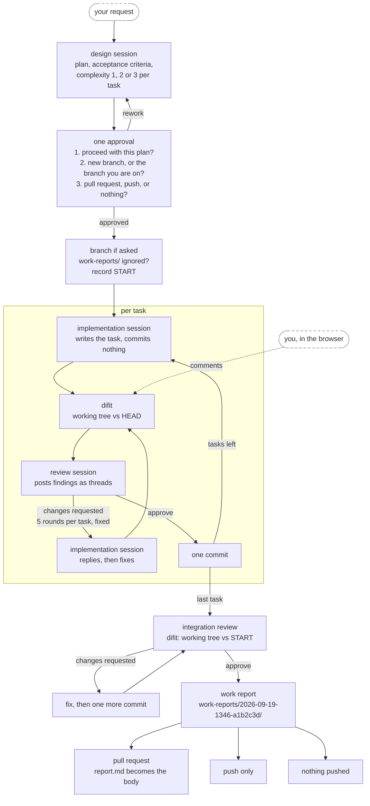

# annetaan

The Claude Code skills we use internally at Annetaan Inc., packaged as one plugin.

```
/plugin marketplace add annetaan/claude-plugins
/plugin install annetaan@annetaan
```

Install it once. As skills get added, `/plugin marketplace update annetaan` and
`/plugin update annetaan@annetaan` are enough to keep up.

## Skills

A skill whose `description` matches a request normally starts without being named. The ones here do not. They run
long-lived local servers, open browsers and add commits, so each waits to be named or invoked by its slash form.

### workflow

`/annetaan:workflow` ([details](skills/workflow))

Runs one implementation through four sessions with different jobs. A design session writes the plan. An
implementation session writes the code. A review session reads it and posts findings. You approve once, near the
start, and answer two questions about where the commits go and how the run should end.

The review rounds happen in [difit](https://github.com/yoshiko-pg/difit), a local diff viewer. difit is the wire
between the implementation session and the review session, and it is also a web page. Open it and your comments
land in the same threads, on the same footing as the reviewer's.



The yellow block repeats for every task in the plan, and nothing inside it runs in parallel, because there is one
working tree. Everything after the approval runs on its own. A task that passes review becomes one commit, so the
commit list reads back as the plan. A task that does not settle in five rounds comes back to you with the open
points laid out, and its changes stay uncommitted in the working tree.

Every run leaves a work report behind, inside the repository under `work-reports/` so that you notice them piling
up. The skill checks that git ignores that directory before it writes anything, and asks before touching
`.gitignore`.

## Agents

These are the sub-agents the skills spawn. Anything under `agents/` becomes callable as `annetaan:<name>`.
The model and the effort are pinned here, and a skill selects one by name alone.

| Agent | Model | Effort | Role |
| --- | --- | --- | --- |
| `annetaan:workflow-design` | fable | medium | design. returns the plan and a complexity of 1, 2 or 3 |
| `annetaan:workflow-design-fallback` | opus | xhigh | the same design role, for environments without Fable |
| `annetaan:workflow-worker-1` | sonnet | medium | implementation (complexity 1) |
| `annetaan:workflow-worker-2` | sonnet | high | implementation (complexity 2) |
| `annetaan:workflow-worker-3` | opus | high | implementation (complexity 3) |
| `annetaan:workflow-reviewer-1` | opus | medium | review (complexity 1) |
| `annetaan:workflow-reviewer-2` | opus | high | review (complexity 2) |
| `annetaan:workflow-reviewer-3` | opus | xhigh | review (complexity 3) |

The agent definitions are thin. The substance of each role lives in the skill's `roles/*.md`, and an agent reads
that path out of the prompt the main session hands it.

## Adding a skill

Create `skills/<name>/SKILL.md`. Everything under `skills/` is picked up on its own. Raise `version` in
`plugin.json` and users see it on their next `/plugin update`.

The slash form is `/annetaan:<directory name>`. The plugin name is prefixed for you, so a directory never needs an
`annetaan-` in front of it.

Agent names share one namespace across every skill in the plugin. Prefix an agent with the skill that owns it
(`workflow-design`, `workflow-worker-1`) and the second skill will not have to rename anything.

### Pointing at a bundled file

Never write an absolute path like `~/.claude/skills/...` when a skill reads a script or a document it ships with.
Installed as a plugin, the real location is under `~/.claude/plugins/cache/annetaan/annetaan/<version>/...`.

A skill that starts always has this at the top of its body:

```
Base directory for this skill: /absolute/path/skills/<skill name>
```

Write SKILL.md against that (`workflow` calls it `$FLOW`). `${CLAUDE_PLUGIN_ROOT}` expands only in hooks, slash
commands and MCP configuration, so it does nothing inside the body of a SKILL.md.
